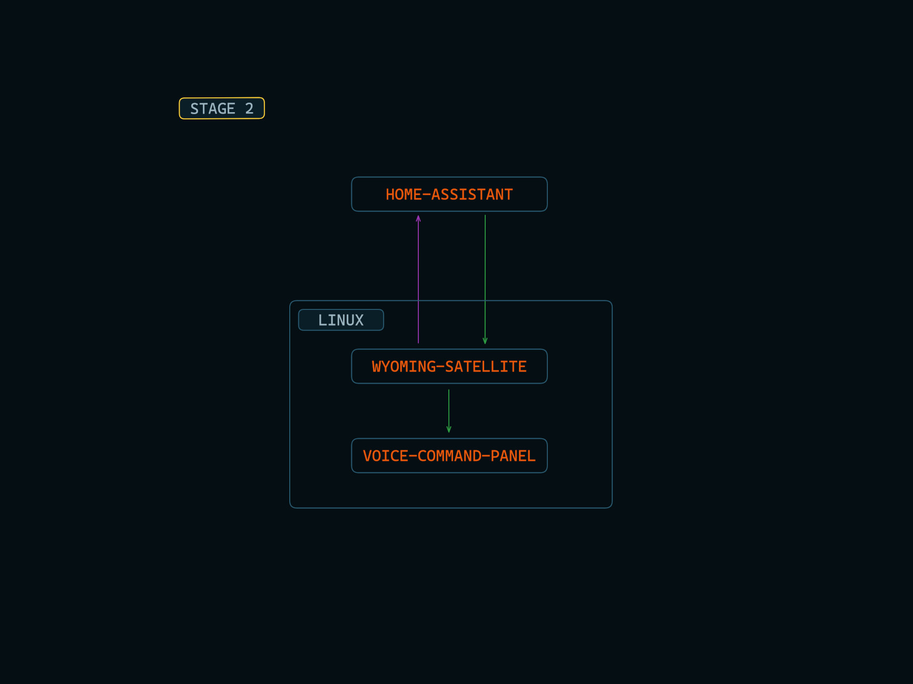

# Virtual Assistant - LUNA

Having a Virtual Assistant like Jarvis is a dream for many automation lovers. But having one perfect tool/program which will cater to various use cases of every individual is impossible.

This is a proof of concept that by utilizing the flexible nature of Linux, and combining it with few open-source tools we can build a pretty convincing setup, that can be tailored to individual workflow.

Check out this demo :  
https://youtu.be/HTyFqfvv86g


# Overview

This is a modular setup. So Replicating this setup is a 7 stage process. 

- Stage 1 : Setup the Wyoming-Satellite

- Stage 2 : Setup the Voice-Command-Panel

- Stage 3 : Setup an Event-Handler

- Stage 4 : Configure Custom Sentences and Actions

- Stage 5 : Setup an Action-Handler

- Stage 6 : Setup a Window Manager

- Stage 7 : Setup Additional Widgets


# Requirements
- The device must be running Linux
- Must have a working MQTT Broker for the Action-Handler setup


# Instructions

## Stage 1 : Setup the Wyoming-Satellite

The idea is to use your Linux device as a client that can communicate with your Home-Assistant server.


- #### STEP 1.1 : Follow this [Official installation instruction](https://github.com/rhasspy/wyoming-satellite) and setup the following
    - Wake Word Detection
    - Speech to Text
    - Text to Speech

- #### STEP 1.2 : Setup an Assistant Pipeline in Home-Assistant

## Stage 2 : Setup the Voice-Command-Panel (Widget)



### Instructions 

- #### STEP 2.1 : Install EWW
   - Follow this [Official installation instruction](https://elkowar.github.io/eww/#how-to-install-eww)

---

- #### STEP 2.2 : Verify if EWW is installed correctly. 
    - Open a terminal and run the command `eww`
    - You should see some help instructions from eww

        
    - Incase you don't get a similar output,
        - Make sure the eww binary is in your '/bin' or '.local/bin' directory and try again.
        - If the issue still exists then your installation is not correct. Go through STEP 2.1 again and reinstall it.

---

- #### STEP 2.3 : Download / Clone this repository

    ``` shell
    git clone https://github.com/nfragment/virtual-assistant-luna.git
    ```

---

- #### STEP 2.4 : Copy all the files from `stage-1/eww` directory to `EWW Config directory`, located at `~/.config/eww`

    ```shell
    cd virtual-assistant-luna && target_dir="$HOME/.config/eww"; [ -d "$target_dir" ] && mv "$target_dir" "$HOME/.config/eww.bak"; cp -r "stage-1/eww" "$HOME/.config/"
    ```

---

- #### STEP 2.5 : Start EWW
    - Run the command `eww daemon`
    - If the daemon is started successfully you will see an output like this.

        

- #### STEP 2.6 : Check if you can open any widget in eww
    - Open the test-window using,

        ``` shell
        eww open test-window 
        ```
    - Close the test-window.

        ``` shell
        eww close test-window
        ```
    - Incase you face any error, terminate all the 'EWW' processes and try again
        
        ``` shell
        killall eww
        ```

- #### STEP 2.7 : Check if you can open the voice-command-panel
    - It will close automatically after 5 seconds.

        ``` shell
        eww open voice-command-panel && sleep 5 && eww close voice-command-panel
        ```

- #### STEP 2.8 : Connect this voice-command-panel to the wyoming-satellite
    - wyoming-satellite gives us some options that we can set when certain events like, wake word is detected, text to speech is completed etc. 
    - We can use these options to show the voice-command-panel whenever the wake word is detected and also change the state of the visual-prompt whenever other events occur.
    - This can be done by adding the following code to the end of your wyoming-satellite's run command

        ``` shell
        --detection-command 'eww open voice-command-panel' --streaming-start-command 'eww update assistant_status=listening' --stt-stop-command 'eww update assistant_status=processing' --synthesize-command 'eww close voice-command-panel' --tts-played-command 'eww update assistant_status=ready'
        ```
 
    - The full command will look something like this

        ```shell
        script/run   --name 'satellite-1'   --uri 'tcp://0.0.0.0:10700'   --mic-command 'arecord -r 16000 -c 1 -f S16_LE -t raw'   --snd-command 'aplay -r 22050 -c 1 -f S16_LE -t raw'   --wake-uri 'tcp://127.0.0.1:10400'  --wake-word-name 'ok_nabu' --detection-command 'eww open voice-command-panel' --streaming-start-command 'eww update assistant_status=listening' --stt-stop-command 'eww update assistant_status=processing' --synthesize-command 'eww close voice-command-panel' --tts-played-command 'eww update assistant_status=ready'
        ```
        > Make sure you have the `mic-command` and `snd-command` pointing to the correct devices according to your setup that you tested in STAGE-1. Otherwise the wake word detection and speech output will not work.

    - Run the wyoming-satellite and Check if you can see the visual-prompt by saying the wake word

    - At this point we have a working visual-prompt, but if we want to see the commands that we say and the responses from the assistant in command-log widget, then we need a little more flexibility in our setup. This can be done using an Event-Handler

