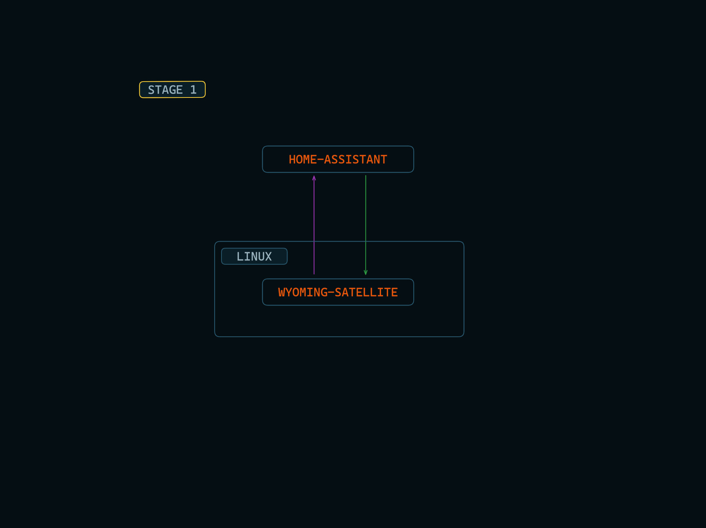

# Virtual Assistant - LUNA

Having a Virtual Assistant like Jarvis is a dream for many automation lovers. But having one perfect tool/program which will cater to various use cases of every individual is impossible.

This is a proof of concept that by utilizing the flexible nature of Linux, and combining it with few open-source tools we can build a pretty convincing setup, that can be tailored to individual workflow.

Check out this demo :  
https://youtu.be/HTyFqfvv86g

# Overview

This is a modular setup. So Replicating this setup is a 7 stage process. 

- Stage 1 : Setup the Wyoming-Satellite

- Stage 2 : Setup the Voice-Command-Panel

- Stage 3 : Setup an Event-Handler

- Stage 4 : Configure Custom Sentences and Actions

- Stage 5 : Setup an Action-Handler

- Stage 6 : Setup a Window Manager

- Stage 7 : Setup Additional Widgets

# Requirements
- The device must be running Linux
- Must have a working MQTT Broker for the Action-Handler setup

# Instructions

## Stage 1 : Setup the Wyoming-Satellite

The idea is to use your Linux device as a client that can communicate with your Home-Assistant server.

- #### STEP 1.1 : Follow this [Official installation instruction](https://github.com/rhasspy/wyoming-satellite) and setup the following
    - Wake Word Detection
    - Speech to Text
    - Text to Speech

- #### STEP 1.2 : Setup an Assistant Pipeline in Home-Assistant
